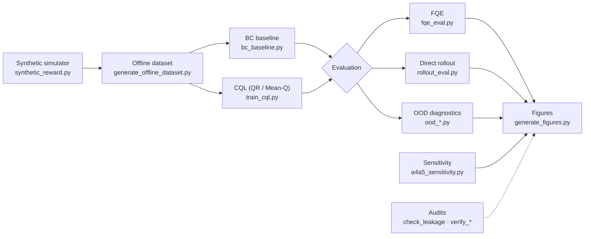

<div align="center">

# Protocol-Dependent Verdicts in Offline Reinforcement Learning

### An Audit of Estimator, Baseline, and Distribution Sensitivity on a Groundwater Pumping Task

**Sumit Kumar Biswal** · **Dr. Bhramara Bar Biswal**

*Manuscript submitted to IEEE Transactions on Neural Networks and Learning Systems (TNNLS)*


[](https://doi.org/10.5281/zenodo.22881193)

[Overview](#overview) ·
[Pipeline](#pipeline) ·
[Repository layout](#repository-layout) ·
[Setup](#setup) ·
[Reproducing the results](#reproducing-the-results) ·
[Artifacts](#large-artifacts) ·
[Citation](#citation)

</div>

---

## Overview

This repository holds the code behind the manuscript above. It asks a narrow question about offline reinforcement learning (RL): **does the verdict on a policy change depending on how it is evaluated?**

The testbed is a synthetic **groundwater pumping** task. An agent chooses a discrete extraction level each quarter, and the simulator returns groundwater dynamics and a reward. Policies are trained offline from logged data (**BC** and **CQL**) and then judged under several evaluation protocols.

The audit varies three things:

| Axis | What changes | Where to look |
|---|---|---|
| **Estimator** | Off-policy estimate (**FQE**) vs. direct simulator rollout | `src/rl/fqe_eval.py`, `src/rl/rollout_eval.py` |
| **Baseline / critic** | **BC** baseline; **QR** critic vs. **Mean-Q** critic in **CQL** | `src/rl/bc_baseline.py`, `src/rl/train_cql.py`, `ood_return_test*.py` |
| **Distribution** | Banded out-of-distribution (OOD) returns and state-distance partitioning | `ood_return_test*.py`, `ood_state_distribution_test.py` |

Two further groups of scripts check that the results are trustworthy: parameter **sensitivity** sweeps (A4/A5) and **audits** for leakage, provenance, and confidence intervals.

---

## Pipeline



---

## Repository layout

```text
trishna-opal/
├── src/
│   ├── rl/                 # RL environment, dataset, training, evaluation  ← this paper
│   ├── downscaling/        # companion paper (context only)
│   ├── models/             # companion paper (context only)
│   └── data/               # companion paper (context only)
├── config/                 # source-of-record hyperparameters (YAML)
├── data/                   # archived RF seed table and held-out wells
├── scripts/                # visualization helpers (companion paper)
├── tests/                  # unit tests for grid alignment, splits, reward
├── ood_return_test.py
├── ood_return_test_meanq.py
├── ood_state_distribution_test.py
├── a4a5_sensitivity.py
├── cgwb_behavioral_validation.py
├── check_leakage.py
├── verify_provenance.py
├── verify_ci.py
├── freeze_project.py
├── generate_figures.py
├── environment.yml
└── requirements.txt
```

> [!NOTE]
> This repository is the full **`trishna-opal`** project, which produced **two papers**. The offline-RL audit uses only the files listed in this README. `src/downscaling/`, `src/models/`, and `src/data/` belong to the companion downscaling paper and are included for context. **The RL experiments do not require running them**, because the RF seed table and held-out wells are already archived under `data/`.

---

## Components

### RL environment and training

| File | Purpose |
|---|---|
| `src/rl/synthetic_reward.py` | Synthetic groundwater pumping simulator |
| `src/rl/generate_offline_dataset.py` | Offline dataset generator |
| `src/rl/bc_baseline.py` | Behavioural cloning (**BC**) training |
| `src/rl/train_cql.py` | Conservative Q-learning (**CQL**) training |

### Evaluation

| File | Purpose |
|---|---|
| `src/rl/fqe_eval.py` | Fitted Q-evaluation (**FQE**) |
| `src/rl/rollout_eval.py` | Direct simulator rollout |
| `ood_return_test.py` | Banded OOD diagnostic, **QR** critic |
| `ood_return_test_meanq.py` | Banded OOD diagnostic, **Mean-Q** critic |
| `ood_state_distribution_test.py` | State-distance partitioning |

### Sensitivity and validation

| File | Purpose |
|---|---|
| `a4a5_sensitivity.py` | A4/A5 parameter sweep |
| `cgwb_behavioral_validation.py` | Rainfall–groundwater sign check |

### Audits and reproducibility

| File | Purpose |
|---|---|
| `check_leakage.py` | Leakage check |
| `verify_provenance.py` | Provenance check |
| `verify_ci.py` | Confidence-interval verification |
| `freeze_project.py` | Project freeze for the submitted state |

### Figures

| File | Purpose |
|---|---|
| `generate_figures.py` | Generates the manuscript figures |

---

## Setup

```bash
# 1. Create and activate the environment
conda env create -f environment.yml
conda activate trishna-opal

# 2. Install the remaining Python dependencies
pip install -r requirements.txt
```

For a description of the datasets and how the initial states were sourced, see [`DATA.md`](DATA.md).

---

## Reproducing the results

Run the stages in this order. Each stage reads the outputs of the one before it.

```bash
# 1. Build the offline dataset from the simulator
python src/rl/generate_offline_dataset.py

# 2. Train the policies
python src/rl/bc_baseline.py
python src/rl/train_cql.py

# 3. Evaluate
python src/rl/fqe_eval.py
python src/rl/rollout_eval.py
python ood_return_test.py
python ood_return_test_meanq.py
python ood_state_distribution_test.py

# 4. Sensitivity and validation
python a4a5_sensitivity.py
python cgwb_behavioral_validation.py

# 5. Audits
python check_leakage.py
python verify_provenance.py
python verify_ci.py

# 6. Figures
python generate_figures.py
```

> [!TIP]
> Training and evaluation scripts may take command-line options (for example, the critic type in `train_cql.py`). Run any script with `--help` to see them.

The `.h5` datasets, `.d3` checkpoints, and per-episode return arrays are **not** in this repository. Download them first (see below), or regenerate them with steps 1–2.

---

## Large artifacts

Large files are archived separately on **Zenodo** to keep the repository small:

- `.h5` offline datasets
- `.d3` model checkpoints
- per-episode return arrays

**DOI:** *to be added*

---

## Citation

If you use this code, please cite the manuscript:

```bibtex
@unpublished{biswal_protocol_dependent_verdicts,
  title  = {Protocol-Dependent Verdicts in Offline Reinforcement Learning:
            An Audit of Estimator, Baseline, and Distribution Sensitivity
            on a Groundwater Pumping Task},
  author = {Sumit Kumar Biswal and Bhramara Bar<div align="center">

# Protocol-Dependent Verdicts in Offline Reinforcement Learning

### An Audit of Estimator, Baseline, and Distribution Sensitivity on a Groundwater Pumping Task

**Sumit Kumar Biswal** · **Bhramara Bar Biswal**

*Manuscript submitted to IEEE Transactions on Neural Networks and Learning Systems (TNNLS)*


-lightgrey)

[Overview](#overview) ·
[Pipeline](#pipeline) ·
[Repository layout](#repository-layout) ·
[Setup](#setup) ·
[Reproducing the results](#reproducing-the-results) ·
[Artifacts](#large-artifacts) ·
[Citation](#citation)

</div>

---

## Overview

This repository holds the code behind the manuscript above. It asks a narrow question about offline reinforcement learning (RL): **does the verdict on a policy change depending on how it is evaluated?**

The testbed is a synthetic **groundwater pumping** task. An agent chooses a discrete extraction level each quarter, and the simulator returns groundwater dynamics and a reward. Policies are trained offline from logged data (**BC** and **CQL**) and then judged under several evaluation protocols.

The audit varies three things:

| Axis | What changes | Where to look |
|---|---|---|
| **Estimator** | Off-policy estimate (**FQE**) vs. direct simulator rollout | `src/rl/fqe_eval.py`, `src/rl/rollout_eval.py` |
| **Baseline / critic** | **BC** baseline; **QR** critic vs. **Mean-Q** critic in **CQL** | `src/rl/bc_baseline.py`, `src/rl/train_cql.py`, `ood_return_test*.py` |
| **Distribution** | Banded out-of-distribution (OOD) returns and state-distance partitioning | `ood_return_test*.py`, `ood_state_distribution_test.py` |

Two further groups of scripts check that the results are trustworthy: parameter **sensitivity** sweeps (A4/A5) and **audits** for leakage, provenance, and confidence intervals.

---

## Pipeline


---

## Repository layout

```text
trishna-opal/
├── src/
│   ├── rl/                 # RL environment, dataset, training, evaluation  ← this paper
│   ├── downscaling/        # companion paper (context only)
│   ├── models/             # companion paper (context only)
│   └── data/               # companion paper (context only)
├── config/                 # source-of-record hyperparameters (YAML)
├── data/                   # archived RF seed table and held-out wells
├── scripts/                # visualization helpers (companion paper)
├── tests/                  # unit tests for grid alignment, splits, reward
├── ood_return_test.py
├── ood_return_test_meanq.py
├── ood_state_distribution_test.py
├── a4a5_sensitivity.py
├── cgwb_behavioral_validation.py
├── check_leakage.py
├── verify_provenance.py
├── verify_ci.py
├── freeze_project.py
├── generate_figures.py
├── environment.yml
└── requirements.txt
```

> [!NOTE]
> This repository is the full **`trishna-opal`** project, which produced **two papers**. The offline-RL audit uses only the files listed in this README. `src/downscaling/`, `src/models/`, and `src/data/` belong to the companion downscaling paper and are included for context. **The RL experiments do not require running them**, because the RF seed table and held-out wells are already archived under `data/`.

---

## Components

### RL environment and training

| File | Purpose |
|---|---|
| `src/rl/synthetic_reward.py` | Synthetic groundwater pumping simulator |
| `src/rl/generate_offline_dataset.py` | Offline dataset generator |
| `src/rl/bc_baseline.py` | Behavioural cloning (**BC**) training |
| `src/rl/train_cql.py` | Conservative Q-learning (**CQL**) training |

### Evaluation

| File | Purpose |
|---|---|
| `src/rl/fqe_eval.py` | Fitted Q-evaluation (**FQE**) |
| `src/rl/rollout_eval.py` | Direct simulator rollout |
| `ood_return_test.py` | Banded OOD diagnostic, **QR** critic |
| `ood_return_test_meanq.py` | Banded OOD diagnostic, **Mean-Q** critic |
| `ood_state_distribution_test.py` | State-distance partitioning |

### Sensitivity and validation

| File | Purpose |
|---|---|
| `a4a5_sensitivity.py` | A4/A5 parameter sweep |
| `cgwb_behavioral_validation.py` | Rainfall–groundwater sign check |

### Audits and reproducibility

| File | Purpose |
|---|---|
| `check_leakage.py` | Leakage check |
| `verify_provenance.py` | Provenance check |
| `verify_ci.py` | Confidence-interval verification |
| `freeze_project.py` | Project freeze for the submitted state |

### Figures

| File | Purpose |
|---|---|
| `generate_figures.py` | Generates the manuscript figures |

---

## Setup

```bash
# 1. Create and activate the environment
conda env create -f environment.yml
conda activate trishna-opal

# 2. Install the remaining Python dependencies
pip install -r requirements.txt
```

For a description of the datasets and how the initial states were sourced, see [`DATA.md`](DATA.md).

---

## Reproducing the results

Run the stages in this order. Each stage reads the outputs of the one before it.

```bash
# 1. Build the offline dataset from the simulator
python src/rl/generate_offline_dataset.py

# 2. Train the policies
python src/rl/bc_baseline.py
python src/rl/train_cql.py

# 3. Evaluate
python src/rl/fqe_eval.py
python src/rl/rollout_eval.py
python ood_return_test.py
python ood_return_test_meanq.py
python ood_state_distribution_test.py

# 4. Sensitivity and validation
python a4a5_sensitivity.py
python cgwb_behavioral_validation.py

# 5. Audits
python check_leakage.py
python verify_provenance.py
python verify_ci.py

# 6. Figures
python generate_figures.py
```

> [!TIP]
> Training and evaluation scripts may take command-line options (for example, the critic type in `train_cql.py`). Run any script with `--help` to see them.

The `.h5` datasets, `.d3` checkpoints, and per-episode return arrays are **not** in this repository. Download them first (see below), or regenerate them with steps 1–2.

---

## Large artifacts

Large files are archived separately on **Zenodo** to keep the repository small:

- `.h5` offline datasets
- `.d3` model checkpoints
- per-episode return arrays

**DOI:** *to be added*

---

## Citation

If you use this code, please cite the manuscript:

```bibtex
@unpublished{biswal_protocol_dependent_verdicts,
  title  = {Protocol-Dependent Verdicts in Offline Reinforcement Learning:
            An Audit of Estimator, Baseline, and Distribution Sensitivity
            on a Groundwater Pumping Task},
  author = {Biswal, Sumit Kumar and Biswal, Dr.Bhramara Bar},
  note   = {Submitted to IEEE Transactions on Neural Networks and Learning Systems}
}
```

---

## License

See [`LICENSE`](LICENSE).

## Contact

Questions about the code or the manuscript: open an issue on this repository.},
  note   = {Submitted to IEEE Transactions on Neural Networks and Learning Systems}
